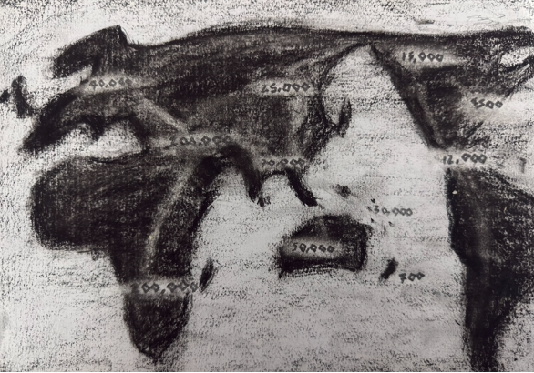

# The Big Bang Theory
How did the universe start? In the past we thought religion explained this but the current theory is - The Big Bang! The big bang says the universe starteed13.8 billion years ago. In that moment all matter was concentrated in a single dense point. Then an explosion caused all matter to expand rapidly from this point (and it's still expanding!). How do we know this? It happened 13.8 billion years ago, how the hell would we know something like that! As scientists we must evidence our claims and for the Big Bang, we have three
- Cosmic microwave background radiation: cooled remnant afterglow of the Big Bang.
- Hubble’s law: galaxies recede from us. 
- Light element abundance
As matter moved through the universe, collisions caused matter to coalesce and form stars.  Young stars use hydrogen and helium and release energy through nuclear fusion, held together by their own gravity. Our Sun is a star that formed about 9 billion years ago and is situated in a galaxy called the Milky Way.  To give a sense of scale, the Milky Way is just one of approximately 400 billion galaxies in the observable universe. Solar system - Sun forms, then planets condense from the disk; Earth is just hot rock

# The Earth

The Earth, formed 4.6 billion years ago with dust surrounding the Sun formed the Earth. Then 4.5 billion years ago a Mars-sized body collided with Earth, resulting in debris that eventually coalesced to form the Moon. 4.0 billion years ago: Earth was a molten mass, constantly bombarded by space matter. It cooled and formed a thin crust. Water vapor condensed, forming Earth's oceans.  3.8 billion years ago: First life appeared on Earth. Microorganisms likely formed in hydrothermal vents or hot springs.  252 million years ago: A mass extinction event occurred—the most severe loss of life in Earth's history.  230 million years ago: Dinosaurs and mammals emerged.  200 million years ago: The supercontinent Pangea began breaking up into the North America & Eurasia (Europe/Asia) and South America, Africa, India, Antarctica, & Australia. 66 million years ago: Another mass extinction, likely caused by a large asteroid impact, led to the continents forming into their current shapes. 7 million years ago: The first hominins emerged, diverging from apes. Key traits: bipedalism and smaller canine teeth.  2 million years ago: The Ice Ages began. 300,000 years ago: The first Homo sapiens appeared in Africa—that's us!  

# Human migration
100,000 years ago: Homo sapiens began migrating out of Africa. Humans started using fire, forming shelters, and hunting with weapons.  10,000 years ago: Human civilisation began and the Ice Ages ended. 10,000 to 5,000 years ago - Humans went from nomadic cultures to settled agriculture. City states started forming. Mesopotamia (Sumerian) culture - modern day Iraq, Syria and Turkey. Civilisation grew up independently in Mesopotamia, Egypt, the Indus Valley, China, Mesoamerica, and the Andes.

# Human Civilisation

# The End of humanity

All good things must come to an End and so will humanity. The question is when and how? I’ve broken it into two main possibilities: 
Man caused:
- Climate change - global warming is a serious threat and now its economical to be pro climate. 
- Nuclear war - if we have one nuke trigger friendly president it’s game over. We are all currently in a Mexican stand-off.
- Engineered pandemics - another COVID could potentially take us out but medical practice is much better now. The black plaque took out about 50% of us.
- Cyberattacks
Cosmic threats
- Asteroid impacts (like 66 million years ago when they wiped out the dinos)  
- Expansion of the Sun in about 5 billion years: hydrogen will run out, and the Sun will become a red giant, engulfing Mercury and Venus. Earth may survive but become uninhabitable due to extreme heat. Mars may become candidate for future habitation.
We are more likely to kill each other than the world is. Our future is in our hands!
